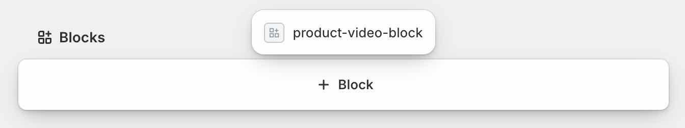

# Installing

Log in to Empower Therapies Dashboard and open this link:

```
https://admin.shopify.com/store/empower-therapies-nz/oauth/install_custom_app?client_id=89831ce5616715f0ecd725e5c3d8c597&no_redirect=true&signature=eyJleHBpcmVzX2F0IjoxNzg2MTYzNTg4LCJwZXJtYW5lbnRfZG9tYWluIjoiZW1wb3dlci10aGVyYXBpZXMtbnoubXlzaG9waWZ5LmNvbSIsImNsaWVudF9pZCI6Ijg5ODMxY2U1NjE2NzE1ZjBlY2Q3MjVlNWMzZDhjNTk3IiwicHVycG9zZSI6ImN1c3RvbV9hcHAifQ%3D%3D--9c1e661c12128695f76ced688f4953b016580bcc
```

## Setting up=

### Configuring Vimeo Videos
If you configure Vimeo videos with domain-level-security, they can only be played on that domain.
You must use the domain of the API, not your shopify site, since playback is not done through Shopify.

### Configuring Product Videos in Shopify

Each Shopify Product may have one or more Vimeo videos.  Only videos in Vimeo are supported.
To add videos to a Shopify Product, in your Product:

1. If it has not already been added and pinned, you must add and pin the Product Videos Block:


1. Enter the number of days that the videos are licenced for. When a product is purchased, the
videos may be played up to this number of days after purchase.

1. Enter the Vimeo Embed URL for each video in the product.  You can also paste the `<iframe...>`
code straight in and it will search for the URL.

1. If the Video should not be available to be played immediately after purchase, select the number of
days after purchase it will be available to play.  0 days means available immediately.  

## Testing
A product licence is issued when an order is paid.  In Shopify dev stores, the order/paid signal is
not sent when you purchase a product using the dummy gateway with test credit card credentials. 
To create the product licence, you must therefore create an order in Shopify Admin > Orders page,
and then Mark As Paid.

## Re-issuing a Licence for free
The same method can be used to issue/re-issue a new licence by creating an order in Shopify Admin > Orders page, then Mark as Paid since no additional payment is required.
